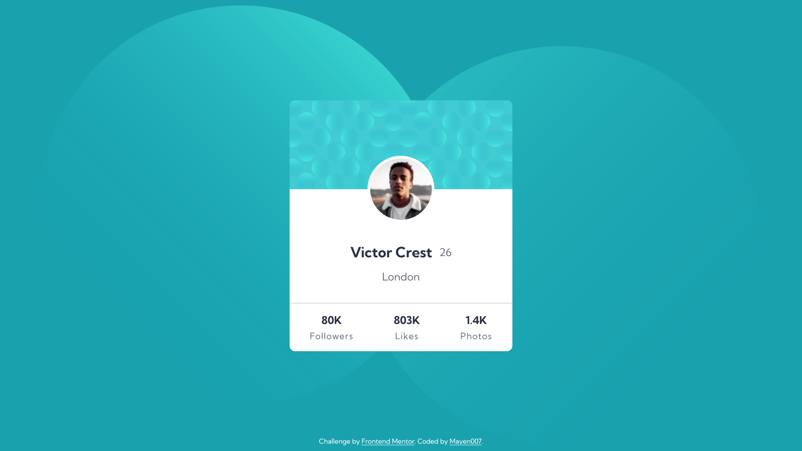
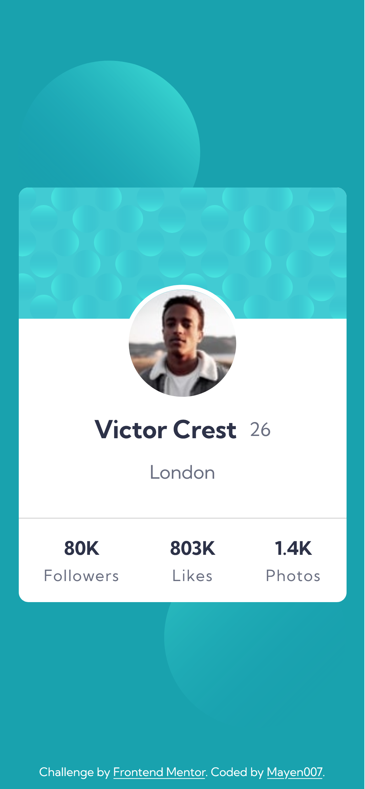

# Frontend Mentor - Profile Card Component Solution

This is my solution to the [Profile Card Component Challenge on Frontend Mentor](https://www.frontendmentor.io/challenges/profile-card-component-cfArpWshJ). Completing this challenge helped me practice working with HTML, CSS, and implementing responsive designs.

## Table of Contents

- [Overview](#overview)
  - [The Challenge](#the-challenge)
  - [Screenshot](#screenshot)
  - [Links](#links)
- [My Process](#my-process)
  - [Built With](#built-with)
  - [What I Learned](#what-i-learned)
  - [Continued Development](#continued-development)
  - [Useful Resources](#useful-resources)
- [Author](#author)
- [Acknowledgments](#acknowledgments)

## Overview

### The Challenge

Users should be able to:

- View the optimal layout of the card depending on the device's screen size.

### Screenshot

#### Desktop View



#### Mobile View



### Links

- [Solution URL](https://github.com/Mayen007/Profile-Card)
- [Live Site URL](https://mayen007.github.io/Profile-Card/)

## My Process

### Built With

- Semantic HTML5 markup
- CSS custom properties
- Flexbox
- Responsive design with media queries
- Custom fonts with `@font-face`
- Mobile-first workflow

### What I Learned

This challenge allowed me to refine my skills in creating responsive designs and using custom fonts. Here's a piece of code I’m particularly proud of:

```css
body {
  background: url(./assets/images/bg-pattern-top.svg) no-repeat left top, url(./assets/images/bg-pattern-bottom.svg)
      no-repeat right bottom, var(--dark-cyan);
  background-position: left 10% top 10%, right 10% bottom 10%;
  background-size: 50%, 50%;
}
```

This setup allowed me to create a visually appealing diagonal background design with two images, showcasing precise control over background positioning and layering.

### Continued Development

I plan to continue focusing on:

- Improving accessibility by ensuring color contrast ratios meet WCAG guidelines.
- Experimenting more with background positioning and custom animations.
- Enhancing performance by optimizing assets like images and fonts.

### Useful Resources

- [CSS Tricks - Multiple Backgrounds](https://css-tricks.com/css-basics-using-multiple-backgrounds/) - Helped me understand how to use multiple background images effectively.
- [Google Fonts Documentation](https://fonts.google.com/) - Helped me set up custom fonts using `@font-face`.
- [MDN Web Docs - CSS Box Shadow](https://developer.mozilla.org/en-US/docs/Web/CSS/box-shadow) - Provided tips on how to create elegant box shadows.

## Author

- **GitHub** - [Mayen007](https://github.com/Mayen007)
- **Frontend Mentor** - [@Mayen007](https://www.frontendmentor.io/profile/Mayen007)

## Acknowledgments

Thanks to the Frontend Mentor community for providing an excellent platform to practice and improve coding skills. The detailed feedback from similar challenges inspired some design and code choices in this project.
